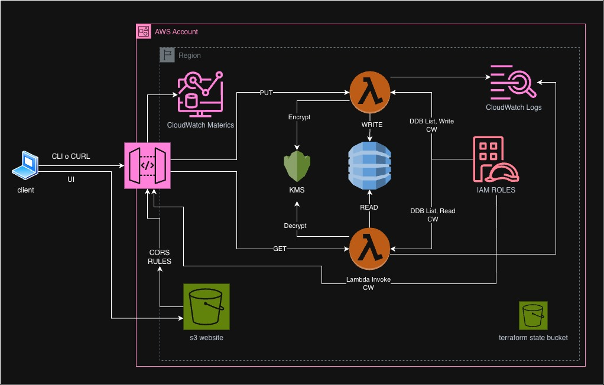

# Satispay_test_project

## 1. Project Overview

**Goal** — POC per un servizio serverless di ingestione e recupero dati JSON: API REST che consente di creare messaggi (POST) e leggerli in lista o per singolo ID (GET), con persistenza su database gestito AWS.

**Core Stack** — AWS, Terraform (IaC), Python (Lambda + script di automazione). Frontend opzionale in React/TypeScript (Vite).

**Key Features**
- Due Lambda (Read / Write) con ruoli IAM distinti e permessi minimi.
- DynamoDB come store principale; crittografia a riposo con KMS.
- API Gateway HTTP API come unico ingresso.
- UI di test opzionale hostata su S3 per verificare il flusso end-to-end.

---

## 2. Architectural Decisions (Mandatory)

### Why Two Lambdas?

Le funzioni sono state separate per applicare il **Principio del Minimo Privilegio (Least Privilege)**:
- **Writer Lambda**: possiede **solo** `dynamodb:PutItem` sulla tabella messaggi (e permessi di log su CloudWatch). Non può leggere né scansionare.
- **Reader Lambda**: possiede **solo** `dynamodb:GetItem`, `dynamodb:Query`, `dynamodb:Scan` (e log). Non può scrivere.

In questo modo un eventuale compromesso di una funzione limita il danno al solo ambito read o write.

### API Gateway

È stata scelta un’**interfaccia HTTP** (API Gateway HTTP API) per **semplicità ed efficienza**: integrazione diretta con Lambda (proxy), basso costo, configurazione CORS e throttling integrata. Ideale per un POC e facilmente estendibile con authorizer in produzione.

### KMS Integration

I dati in DynamoDB sono **cifrati a riposo** con una chiave KMS dedicata (rotazione abilitata). La policy KMS limita l’uso della chiave al solo servizio DynamoDB nell’account/region. Questa scelta eleva lo standard di sicurezza oltre i requisiti base e garantisce confidenzialità dei dati.

---

## 3. Architecture Diagram

È possibile inserire qui l’immagine dell’architettura preparata (`cloud_architecture.jpg`), posizionandola nella root del repo o in una cartella `docs/`.



**Legenda del flusso dati**
1. **Client (CLI o browser UI)** invia richieste HTTP all’endpoint pubblico di API Gateway.
2. **API Gateway** instrada in base a metodo e path: `GET /messages` e `GET /messages/{id}` → Lambda Reader; `POST /messages` → Lambda Writer.
3. **Lambda** eseguono la logica (validazione, serializzazione) e accedono a **DynamoDB** con le credenziali del proprio ruolo IAM.
4. **DynamoDB** persiste i messaggi; i dati sono cifrati con **KMS**.
5. *(Opzionale)* Il **sito statico** su S3 viene servito al browser; le chiamate API passano da browser → API Gateway (CORS abilitato per l’origine S3).

---

## 4. Getting Started (Quick Start)

### Prerequisites

- **AWS CLI** — [Installazione](https://docs.aws.amazon.com/cli/latest/userguide/getting-started-install.html) e profilo configurato (`aws configure --profile <nome>`).
- **Terraform** — [Installazione](https://developer.hashicorp.com/terraform/install); deve essere in PATH.
- **Python 3** — per gli script di setup/destroy; [python.org](https://www.python.org/downloads/).
- **Node.js / npm** — solo se si intende rilasciare l’UI di test: [nodejs.org](https://nodejs.org/).

### One-Command Setup

Lo script **`first_configuration.sh`** (macOS/Linux) o **`first_configuration.cmd`** (Windows) gestisce l’intero setup in un unico comando:

- Scelta del **profilo AWS** (da `aws configure list-profiles`).
- Domanda se **rilasciare anche l’UI** (build + upload su S3).
- **Bootstrap** del backend Terraform (bucket S3 per lo state).
- **Scrittura** di `backend.hcl` con bucket, key, region e metadato per il destroy.
- **Init e apply** dell’infrastructure root (Lambda, API Gateway, DynamoDB, KMS, eventuale S3 website).
- **Build e deploy** del frontend (se richiesto) e upload su S3.

**macOS / Linux**
```bash
./macos_linux_installation/first_configuration.sh
```

**Windows**
```cmd
windows_installation\first_configuration.cmd
```

Lo script crea un virtualenv in `.venv`, installa le dipendenze Python (`questionary`) e lancia lo script Python corrispondente (`first_configuration.py` o `first_configuration_win.py`).

### Environment Variables

Al termine del apply, lo script **genera automaticamente** il file `cloud_infrastructure/infrastructure/s3_website/code/.env.local` con:

```env
VITE_API_BASE_URL=<api_base_url>
```

`<api_base_url>` è l’output Terraform dell’endpoint dell’API (es. `https://xxxx.execute-api.eu-central-1.amazonaws.com/test`). Questo file viene usato dal frontend per le chiamate API; se si fa solo deploy da script, non serve configurarlo a mano.

---

## 5. How to Test

### CLI Test

Usa l’**API Base URL** restituito in output dopo il setup (o da `terraform output -raw api_base_url` nella cartella `cloud_infrastructure/infrastructure`).

- **Creare un messaggio (MANDARE)**
  ```bash
  curl -X POST "$API_BASE_URL/messages" \
    -H "Content-Type: application/json" \
    -d '{"message":"Hello world","title":"First meassage"}'
  ```
  Risposta attesa: `201` con body JSON contenente `message_id`, `message`, `created_at`, `title`.

- **Leggere tutti i messaggi (LEGGERE)**
  ```bash
  curl "$API_BASE_URL/messages"
  curl "$API_BASE_URL/messages?limit=10"
  ```

- **Leggere un messaggio per ID**
  ```bash
  curl "$API_BASE_URL/messages/<message_id>"
  ```

È possibile raccogliere questi comandi in uno script (es. `scripts/test_cli.sh`) passando `API_BASE_URL` come variabile d’ambiente per un test rapido ripetibile.

### UI Test (Optional)

Se durante il setup è stata scelta l’opzione **“Release UI site”**:

1. Alla fine dello script viene stampato l’**URL del sito** (output `website_url`).
2. Aprire tale URL nel browser per accedere all’interfaccia: lista messaggi, dettaglio, form di creazione.
3. L’UI usa `VITE_API_BASE_URL` (generato nello step di setup) per tutte le chiamate; CORS è configurato sull’API Gateway per l’origine del sito S3.

---

## 6. Technical Implementation Details

### Project Structure

Organizzazione **modulare** Terraform:

- **`cloud_infrastructure/infrastructure/`** — root dello stack: `main.tf` orchestra i moduli; `backend.tf` dichiara il backend S3; variabili in `variables.tf`.
- **`cloud_infrastructure/infrastructure/bootstrap/`** — crea il bucket S3 per lo state Terraform.
- **`cloud_infrastructure/infrastructure/resources/`** — modulo “cloud_resources”: Lambda, DynamoDB, KMS, IAM, API Gateway; definizioni route e integrazioni.
- **`cloud_infrastructure/modules/`** — moduli riutilizzabili:
  - `lambda` — packaging e deploy Lambda (runtime Python, env vars, log group). Vista la semplicità del codice lambda ho preferito usare la funzione built-in di terraform per la build delle lambda piuttosto che un Makefile (scelta più sicura in caso di funzioni con dipendenze esterne)
  - `iam` — ruolo + policy da lista di statement (Least Privilege).
  - `api_gtw_lambda_integration` — route API Gateway con integrazioni verso Lambda (HTTP API v2).
- **`cloud_infrastructure/tags/test/`** — tag comuni per l’ambiente test.
- **`macos_linux_installation/`** e **`windows_installation/`** — script di automazione e `requirements.txt`.

### State Management

Lo **state Terraform** è remoto in **S3** (bucket creato dal bootstrap). Il file `backend.hcl` (generato dallo script di setup) contiene `bucket`, `key`, `region`, `encrypt`; non viene committato per evitare dati sensibili. Nel file troverete anche `# meta.test_via_ui=true`, variabile che serve agli script di automazione per capire se è stato rilasciato anche il sito, ma che resta nascosta al terraform in fase di configurazione del backend. Init della root si fa con:

```bash
terraform init -reconfigure -backend-config=backend.hcl
```

### Security & IAM

- **Lambda Reader**: policy con solo `dynamodb:GetItem`, `dynamodb:Query`, `dynamodb:Scan` sulla tabella (e indici); `logs:CreateLogStream`, `logs:PutLogEvents` limitati al proprio log group.
- **Lambda Writer**: policy con solo `dynamodb:PutItem` sulla tabella; stessi permessi log sul proprio log group.
- **KMS**: policy che consente l’uso della chiave solo a DynamoDB nello stesso account/region (`kms:ViaService`, `kms:CallerAccount`).
- **S3 (state bucket)**: blocco accessi pubblici, versioning e cifratura; nessuna policy pubblica.
- **S3 (website)**: policy che concede solo `s3:GetObject` sugli oggetti del bucket; CORS sull’API limitato all’origine del sito.

### Observability

- **CloudWatch Logs**: ogni Lambda ha un log group dedicato (`/aws/lambda/<nome>`); API Gateway scrive in un log group (`/aws/apigateway/...`). Retention 14 giorni.
- **API Gateway**: throttling configurato (burst/rate); access log con `requestId`, `requestTime`, `routeKey`, `status`, `integrationError`, `errorMessage`. Le metriche standard di API Gateway sono attive nella console AWS.

---

## 7. Future Improvements (Vision)

### Scalability

- **DynamoDB Accelerator (DAX)** — per letture massive e bassa latenza su `GET /messages` e `GET /messages/{id}`; cache in-memory davanti a DynamoDB senza modificare il codice delle Lambda.
- **Caching su API Gateway** — abilitare la cache sulle route GET per ridurre le letture a DynamoDB.
- **DynamoDB** — valutare capacità provisionate (RCU/WCU) se il carico diventa prevedibile; mantenere on-demand per carichi variabili.

### Security

- **AWS WAF** — associare un Web Application Firewall all’API Gateway per proteggere da attacchi comuni (SQL injection, XSS, rate limiting avanzato, geo-blocking).
- **Autenticazione** — integrare Cognito o Lambda authorizer (JWT/OAuth) per proteggere le route in produzione.
- **Secrets** — eventuali segreti in AWS Secrets Manager o Parameter Store; nessun segreto hardcoded.

### CI/CD

- **Automazione del deploy** tramite **GitHub Actions** o **AWS CodePipeline**:
  - On push su `main`: `terraform plan` (o apply in ambiente staging).
  - Build del frontend e upload su S3 in pipeline.
  - Approvazione manuale per apply in produzione.
- **Destroy** — mantenere gli script Python/Bash per teardown manuale o in job schedulato per ambienti effimeri.

---

*Progetto realizzato per il colloquio tecnico con Satispay. Focus su semplicità, sicurezza (Least Privilege, KMS) ed efficienza operativa (one-command setup, osservabilità).*
